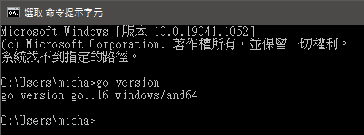

# Use Golang and third-party libraries to write cryptography-related programs

Editing date: 2021/09/02
Editor: Shen Nongxiang
Mailbox: g08410117@ccu.edu.tw

Remark:
> Due to the variety of elliptic curve parameter settings, the data produced by third-party libraries in other places,
> It may not be possible to use the equality test provided by the pre-compiled smart contract on ethereum for comparison
> If you need to implement it in the future, you need to pay attention to this issue
> The library used by this code is compatible with the algorithm defined on BN256 on Ethereum

## One, the environment

1. Windows installation environment

Windows version:
> Windows 10 Professional

system:
> Processor: Intel(R) Core(TM) i5-6500 CPU @ 3.20GHz 3.19GHz
> Memory (RAM): 8.00 GB
> System type: 64-bit operating system, x64 processor

## Two, Installation

1. Download and install the executable file from the official website: [Official website](https://golang.org/doc/install)

Query Golang version: go1.16 windows/amd64

```CMD
go version
```



## Three, environment setting and execution

1. Please move clearmatics/ in the folder to $GOPATH/src and execute the following command (this command needs to be executed once before each execution)

-The library is modified from: [https://github.com/clearmatics/bn256](https://github.com/clearmatics/bn256)
-Due to the modification of part of the source code, there is no way to directly use go get to grab it and use it
-Remember to execute the following command to cancel the use of go module
```CMD
set GO111MODULE=off
```

2. Run the main program

```CMD
go run main.go
```

Remark:
> The main program (main.go) implements all the cryptographic algorithms mentioned in the paper  
> It should be noted that the H1 hash function is defined as G1 -> {0,1}^(4λ)   
> Because I did not find a reliable or universal way to implement  
> My approach is to implement a function (Hash1) that can eat an element under G1 (hereinafter referred to as data)  
> I use sha256 to convert data into sha256 format, which forms a fixed-length hash value  
> I repeat the hash value 4 times and then concatenate it, that is to say, my λ is set to double the length of the hash value  
> Finally, the returned result of hash1 will be similar to this form: (sha256(data)||sha256(data)||sha256(data)||sha256(data))  
> Where the'||' symbol means concatenation  
