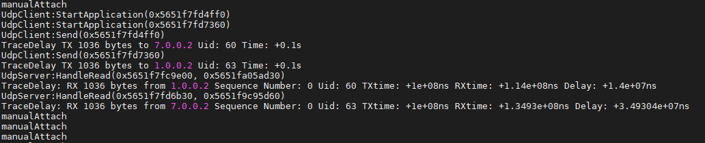
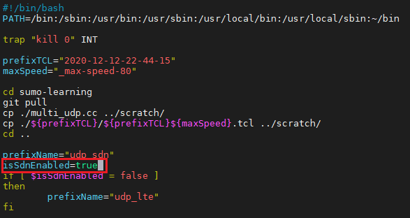

# About NS-3 execution environment, installation and execution method

Editing date: 2021/06/27
Editor: Shen Nongxiang
Mailbox: g08410117@ccu.edu.tw

## One, the environment

1. Check linux release and version

``` bash
cat /etc/*-release
```

Version related information is as follows:
> DISTRIB_ID=Ubuntu
> DISTRIB_RELEASE=20.04
> DISTRIB_CODENAME=focal
> DISTRIB_DESCRIPTION="Ubuntu 20.04.2 LTS"
> NAME="Ubuntu"
> VERSION="20.04.2 LTS (Focal Fossa)"
> ID=ubuntu
> ID_LIKE=debian
> PRETTY_NAME="Ubuntu 20.04.2 LTS"
> VERSION_ID="20.04"
> HOME_URL="https://www.ubuntu.com/"
> SUPPORT_URL="https://help.ubuntu.com/"
> BUG_REPORT_URL="https://bugs.launchpad.net/ubuntu/"
> PRIVACY_POLICY_URL="https://www.ubuntu.com/legal/terms-and-policies/ privacy-policy"
> VERSION_CODENAME=focal
> UBUNTU_CODENAME=focal

2. Query basic system information

```bash
uname -a
```

System related information is as follows:
> Linux Dell3 5.8.0-53-generic #60~20.04.1-Ubuntu SMP Thu May 6 09:52:46 UTC 2021 x86_64 x86_64 x86_64 GNU/Linux

## Two, NS-3 installation

1. Follow the instructions on the official website to install the corresponding pre-package (Prerequisites chapter): [Official website link](https://www.nsnam.org/wiki/Installation#Installation)

2. Install NS-3 (Installation chapter)
Basically install ns3 according to the manual installation instruction on the official website, but there are some discrepancies in some places, it is recommended to use the following instructions to install

```bash
cd
git clone https://gitlab.com/nsnam/ns-3-allinone.git
cd ns-3-allinone
./download.py # Originally on the official website is ./download.py -n ns-3.30
```

After completion, the folder "ns-3-dev/" will appear

## Three, NS-3 simulation program execution

1. Please enter the folder "ns-3-dev/"

```bash
cd
cd ns-3-allinone/ns-3-dev/
```

2. Make initial settings

```bash
./waf clean
./waf configure --build-profile=debug --enable-examples --enable-tests
```

If there are missing kits, this instruction should remind you which kits you need to install

3. Copy the necessary data into this folder
Please copy "ns3-learning/" in the same folder as README.md to the "ns-3-dev/" folder on linux

4. Precautions before running the main program
-Some files under ns3-learning/ need to be produced through SUMO first, you can read another copy under sumo/ [README.md](../sumo/README.md)
-The generated sumo path file (\*.tcl), please use resetSec.py under "ns3-learning" to reset the seconds
-If necessary, remember to change to your own file path and name
```bash
python resetSec.py 2020-12-12-22-44-15/2020-12-12-22-44-15_max-speed-80.tcl
```
  
-Please execute the following commands before running the main program (multi_udp.cc) for the first time. My experiment uses the data under 2020-12-12-22-44-15/
-If necessary, remember to change to your own file path and name

```bash
cp ns3-learning/multi_udp.cc scratch
cp ns3-learning/2020-12-12-22-44-15/2020-12-12-22-44-15_max-speed-80.tcl scratch
./waf --run "scratch/multi_udp --traceFile=scratch/2020-12-12-22-44-15_max-speed-80.tcl --numberOfUes=5 --startUe=0 --endUe=4 - isSdnEnabled=true --isDownlink=true --isUplink=true --interAppInterval=1 --interPacketInterval=1000"
```

The first execution will take a long time to compile and will consume a lot of CPU
Since the batch file (run.sh) will need to be executed later to execute multiple simulation programs at once, execute the above command once and let him compile it again
It doesn’t take so much time and resources to compile afterwards
After the execution result similar to the following appears, you can press ctrl+C to terminate the program



5. Run the main program
-First copy the shell script (run.sh) from ns3-learning/ to ns-3-dev/

```bash
cp ns3-learning/run.sh.
```

-Execute script

```bash
sh run.sh
```

-The script has two modes, you can enter the run.sh script to modify it if you need
One is to simulate the SDN handover mode, and the other is to use the original 4G handover mode (3GPP-X2)
As shown below,  
Set isSdnEnabled to true to simulate SDN handover mode
Set isSdnEnabled to false to use the original 4G handover mode



In addition, some parameter settings can also be set in run.sh

6. Wait for the result

Take the parameter settings in the above figure as an example, when your
prefixTCL is "2020-12-12-22-44-15"
maxSpeed ​​is "_max-speed-80"
isSdnEnabled is "true"

Then you execute the script and a folder named "outLog_max-speed-80_udp_sdn/" will be generated

7. Print out the chart

After successfully outputting "outLog_max-speed-80_udp_sdn/" and "outLog_max-speed-80_udp_lte/"
First copy the python file (diff_time.py) from ns3-learning/ to ns-3-dev/
Then execute the following command

```bash
# outLog_max-speed-80_udp_ is the common prefix of the two output logs, change the file name as required
python diff_time.py outLog_max-speed-80_udp_
```

The diff_time.py file mainly does three things:
-Find out the time point of sdn handover time, and then grab the interval before and after handover in each log file
-In these intervals, sort out the throughput under various routes to calculate the upload and download delays
-Then printed the difference between 3GPP-X2 (traditional 4G practice) and SDN handover

Finally, it will be exported into a folder named "outLog_max-speed-80_udp_"
The data inside is used as cache, saving the time of program execution and debugging
If you need to rerun the program with a new data set, you need to delete this folder

8. Calculate delay

```bash
python response_delay.py
```

## Four, common instruction notes

1. Optimized mode

It may save a bit of execution time, but some log information cannot be printed

```bash
./waf clean
./waf configure --build-profile=optimized --enable-examples --enable-tests
```

2. List NS_LOG_COMPONENT_DEFINE

This command can list NS_LOG_COMPONENT,
You can write in the ns3 main program (multi_udp.cc) to choose which component you want to see the log generated

```bash
find. -name'*.cc' | xargs grep NS_LOG_COMPONENT_DEFINE
```

3. Used to search for specific components

```bash
find. -name'*.cc' | xargs grep NS_LOG_COMPONENT_DEFINE | grep -i sink
```

grep -i ignores case

4. Some NS3 logs can be displayed by setting environment variables

```bash
export NS_LOG=UdpL4Protocol
./waf --run first
```