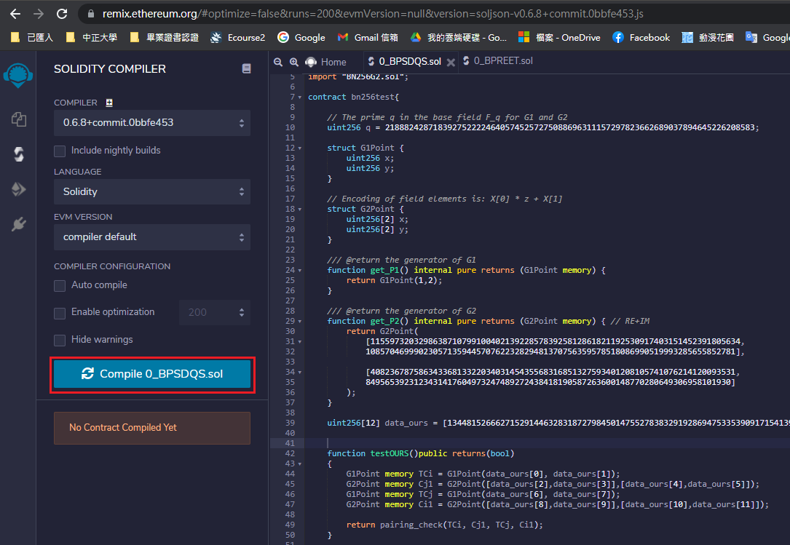
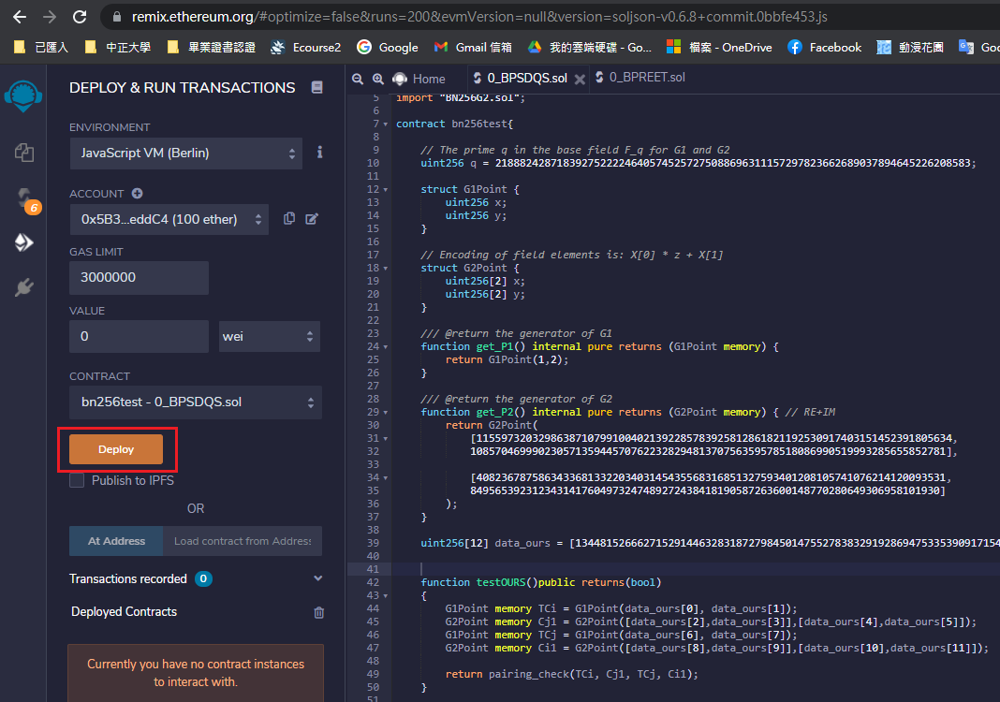
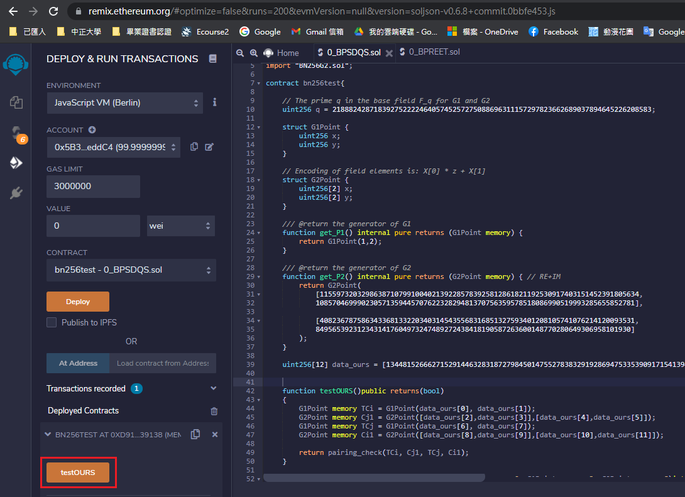
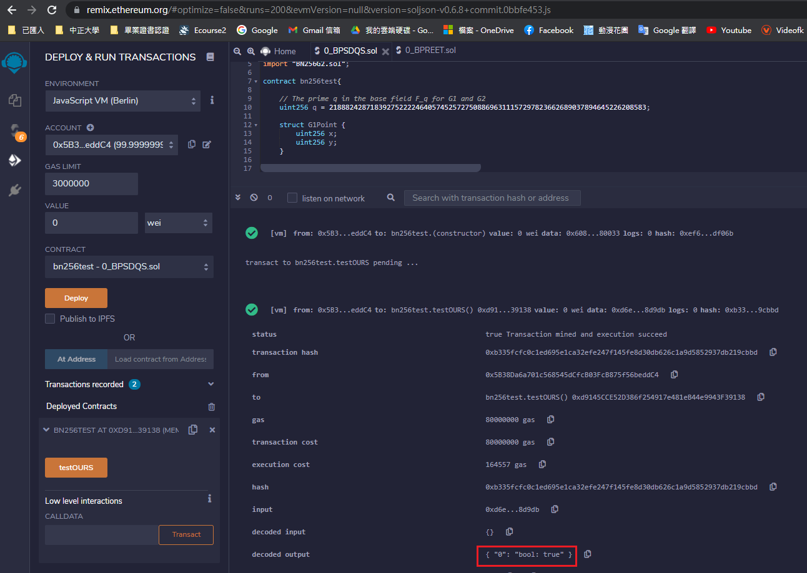

# About the writing and execution of smart contract

Editing date: 2021/06/27
Editor: Shen Nongxiang
Mailbox: g08410117@ccu.edu.tw

## One, the environment

1. Environment

Ethereum Remix IDE: [URL](https://remix.ethereum.org/)

## Two, execution

1. Place "BPREET.sol", "BPRDQS.sol", "BN256G2.sol", "BN256G1.sol" under the folder on the Remix IDE
-Among them, "BN256G2.sol" and "BN256G1.sol" are the G1 and G2 solidity libraries implemented on the elliptic curve BN256
-"BPRDQS.sol" is the smart contract under the scheme implemented by us, which includes equality test
-"BPREET.sol" is the smart contract under the scheme we want to compare, which includes operations such as equality test and re-encryption

2. Open the smart contract you want to subordinate on the Remix IDE, and compile it first, as shown in the figure below

3. After the compilation is complete, if there is no problem, you can perform subordinate actions

Remark:
-If the amount of calculation is too large, the browser page will crash directly
-If the GAS LIMIT is insufficient, you can try to increase it

4. After the subordinates are completed, as shown in the figure below, click the "testOurs" button in the figure to send the transaction

This button corresponds to the "testOURS" function in the smart contract
The parameters used by this function come from the uint256[12] data_ours variable in solidity
> The variable content is a pre-filled value. For the value generation method, please refer to [README.md](../golang-ethereum/README.md) under the "golang-ethereum/" folder
> Why do you need to pre-fill? The reason is that the Remix IDE can’t eat too long input. It is a compromise to use pre-filling for testing.

5. Confirm the transaction result, as shown below

The red box in the figure is the result of equality test
In addition, the consumption caused by calculation (execution cost) is 164557 gas

## Three, reference materials

1. Elliptic curve BN256 library: [https://github.com/witnet/bls-solidity](https://github.com/witnet/bls-solidity)
2. Pre-compiled smart contract related information: [https://eips.ethereum.org/](https://eips.ethereum.org/)