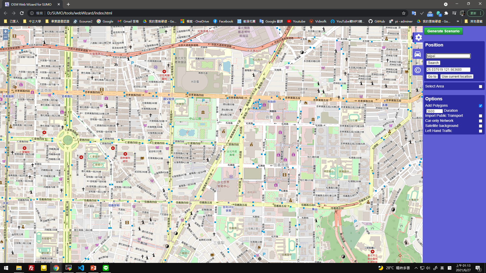
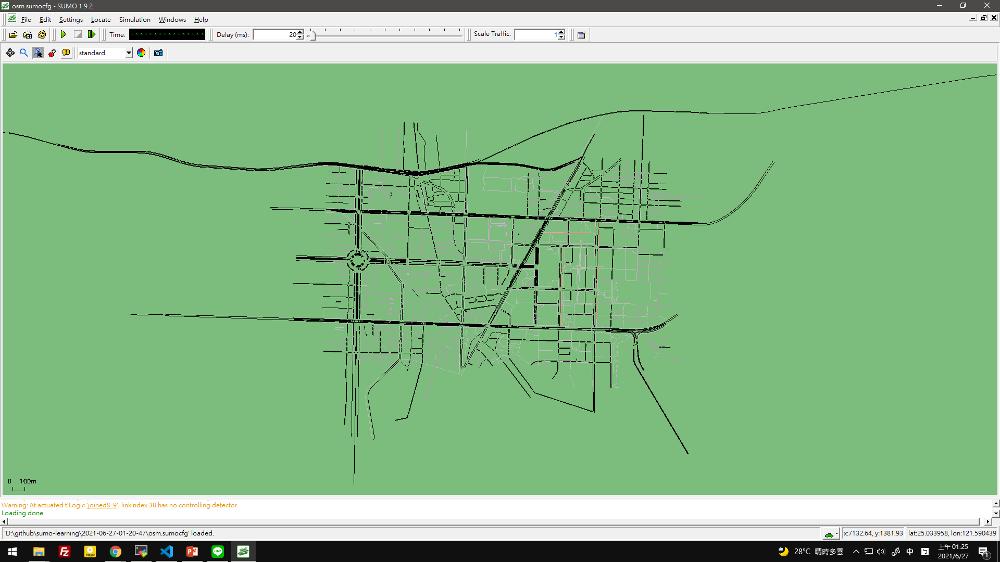
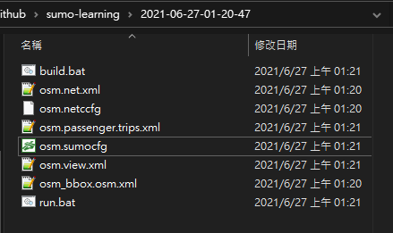
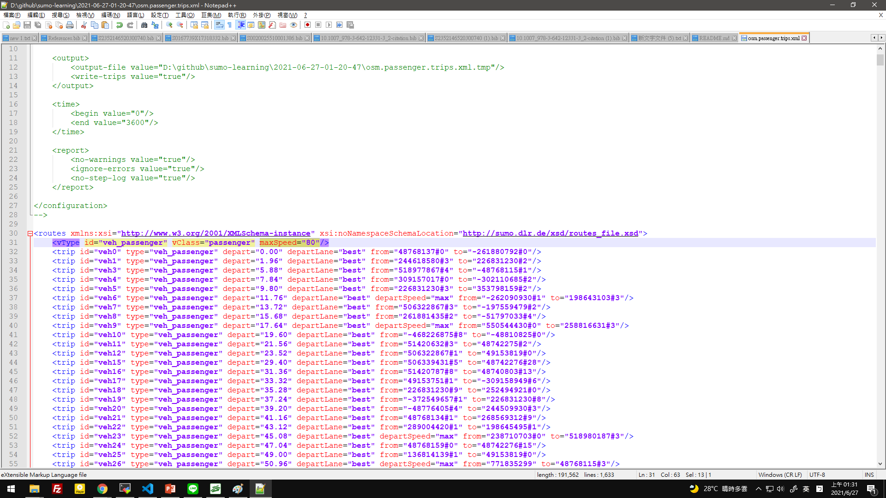
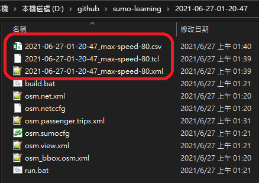

# About sumo execution environment and installation and execution methods

Editing date: 2021/06/27
Editor: Shen Nongxiang
Mailbox: g08410117@ccu.edu.tw

## One, the environment

1. Windows installation environment

Windows version:
> Windows 10 Professional

system:
> Processor: Intel(R) Core(TM) i5-6500 CPU @ 3.20GHz 3.19GHz
> Memory (RAM): 8.00 GB
> System type: 64-bit operating system, x64 processor

Browser:
> Chrome version 91.0.4472.106 (official version) (64-bit)

## Two, Installation

1. Go to the official website to download and execute the installation file: [Official website link](https://sumo.dlr.de/docs/Installing/index.html#windows)

## Three, Use OSM Web Wizard to circle the map and generate traffic flow

1. Open the windows taskbar and search for "OSM Web Wizard" and execute it

2. OSM Web Wizard is a python file, please use python to execute the file

3. After successful execution, the browser will open, as shown in the figure below:



4. Check "Select Area" in the toolbar on the right, after selecting a map of appropriate size, click "Generate Scenario" in the upper right corner to generate traffic flow
(Optional) Uncheck "Add Polygons" in the toolbar on the right to not add the building

* If you use the OSM Web Wizard to circle and generate the map, you can try to clear the browser cookies and other settings when it cannot be generated normally.

5. After the generation is completed, the SUMO main program will be automatically opened, as shown in the figure below, remember to write down the storage path of the configuration file



6. The folder under the profile should be as shown in the figure below:



7. You can set the maximum speed of the vehicle through the "osm.passenger.trips.xml" file under the folder, as shown below:




8. Use the following commands to generate traffic path files (*.tcl) that can be used as input by NS3

The following commands are commands under Windows CMD, remember to modify the corresponding variables if necessary

``` CMD

:: Set the environment variables under CMD, which are the path where the config folder is located, the folder name, and the set maximum speed
set PATH_TO_CONFIG=D:\github\sumo-learning
set SUMO_PREFIX=2020-12-12-22-44-15
set SUMO_MAXSPEED=_max-speed-80
:: Simulation start and end time
set SIM_BEGIN=270
set SIM_END=420

:: Generate file path name
set SUMO_CONFIG=%PATH_TO_CONFIG%\%SUMO_PREFIX%\osm.sumocfg
set SUMO_XML=%PATH_TO_CONFIG%\%SUMO_PREFIX%\%SUMO_PREFIX%%SUMO_MAXSPEED%.xml
set SUMO_CSV=%PATH_TO_CONFIG%\%SUMO_PREFIX%\%SUMO_PREFIX%%SUMO_MAXSPEED%.csv
set SUMO_TCL=%PATH_TO_CONFIG%\%SUMO_PREFIX%\%SUMO_PREFIX%%SUMO_MAXSPEED%.tcl
echo %SUMO_PREFIX%
echo %SUMO_CONFIG%
echo %SUMO_XML%
echo %SUMO_TCL%

:: Generate a mobility trace file (*.tcl) that NS3 can input to the same folder
sumo -c %SUMO_CONFIG% --fcd-output %SUMO_XML% --step-length 1
python D:\SUMO\tools\traceExporter.py --fcd-input %SUMO_XML% --ns2mobility-output %SUMO_TCL% --begin %SIM_BEGIN% --end %SIM_END%
python D:\SUMO\tools\traceExporter.py --fcd-input %SUMO_XML% --gpsdat-output %SUMO_CSV% --begin %SIM_BEGIN% --end %SIM_END%

```

9. The generated files are as follows:

